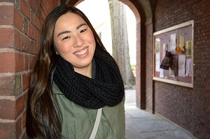
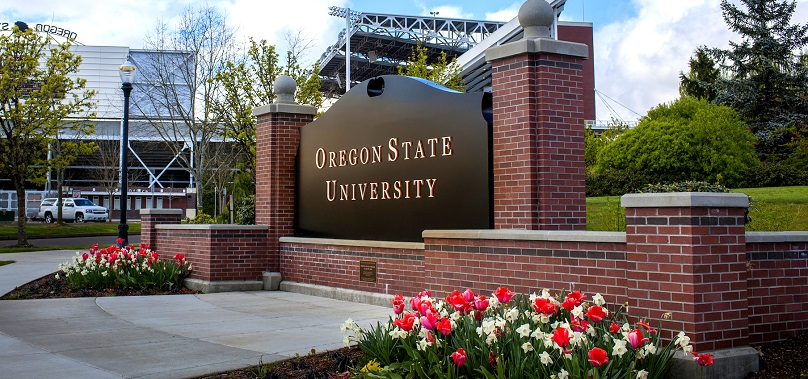

# Colette Pruitt                                           

1234 Main St., Corvallis, OR 97330

(541) 867-5309

Personal Email: pruittc@oregonstate.edu

Personal Website: [Colette Pruitt](http://www.colettepruitt.com)

Linkedin Profile: [Colette Pruitt](http://www.linkedin.com/in/colettepruitt)

## Summary

I'm an undergraduate that puts hard work and determination into everything I do. I am not afraid to ask questions and will make sure that I'm doing my task correctly.

>The three great essentials to achieve anything worth while are: Hard work, stick-to-itiveness, and common sense.
>
>-Thomas A. Edison

## Work Experience (only last 10 years)

#### Oregon State University (Corvallis, OR)

* Dixon Recreation Center

    + Aquatic Supervisor                   (Sept 2017 - Present)
    + Assistant Aquatic Supervisor            (Sept 2016 - Aug 2017)
    + Lead Guard        (Sept 2014- Aug 2016)
    + Lifeguard         (Sept 2013-Aug 2014)

    Understand mechanical workings of the pool. Ensure patron safety. Maintain the facility. Save lives.

    | Skills   | Certificates |
    | -------  | -------------|
    | Swimming | Lifeguard    |
    | Emergency Preparedness |  AED |
    | Communication    |  First Aid |

## Education

#### Oregon State University (Corvallis, OR)

##### Bachelors of Science in Fisheries and Wildlife (Expected June 2018)
+ Specialization in Mammal Health and Behavior
##### Undergraduate GISience Certificate (Expected June 2018)

[Oregon State University](http://www.oregonstate.edu)
